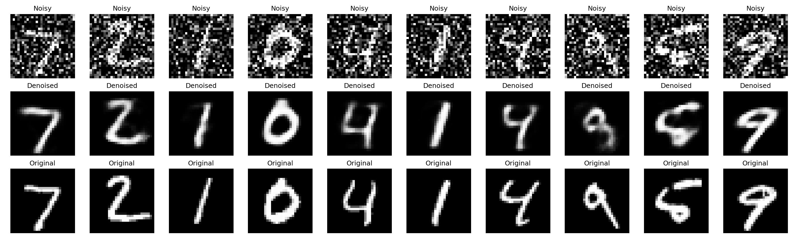
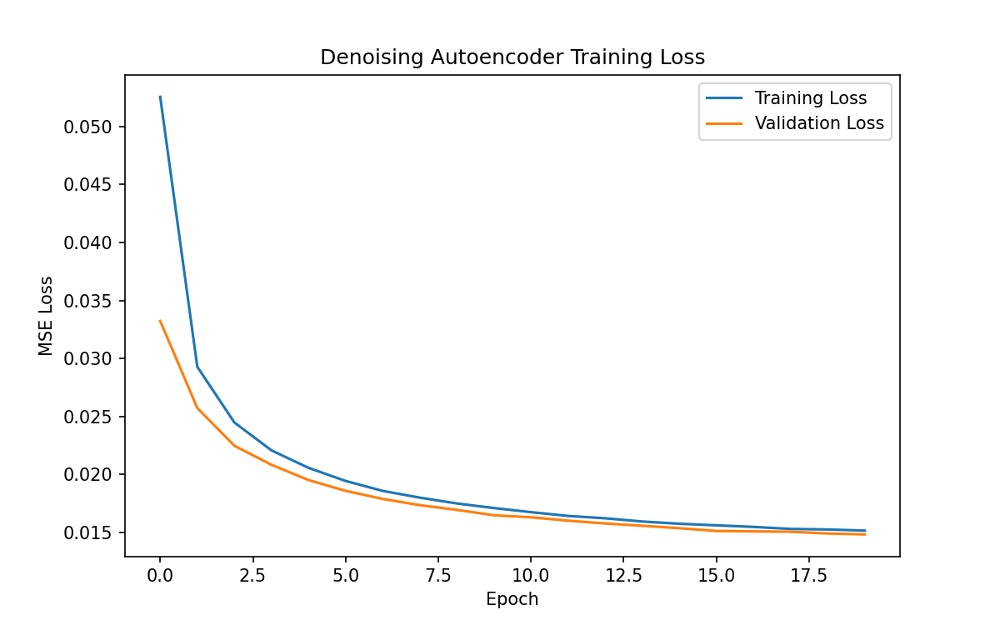

# MNIST Denoising Autoencoder

A PyTorch implementation of a Denoising Autoencoder trained on the MNIST dataset. The model learns to remove Gaussian noise from handwritten digit images while preserving the underlying digit structure.

## Project Overview

1. Load and preprocess the MNIST dataset (normalized to [0, 1])
2. Add Gaussian noise to create noisy input images
3. Build and train a Denoising Autoencoder using noisy images as input and clean images as targets
4. Generate denoised outputs on the test set
5. Visualize and evaluate results

## Model Architecture

A fully-connected (linear) autoencoder:

- **Encoder:** 784 → 256 → 64 (ReLU activations)
- **Decoder:** 64 → 256 → 784 (ReLU, final Sigmoid)

The 64-dimensional bottleneck forces the model to learn a compressed representation that captures essential digit structure while discarding noise.

## Training Setup

- **Loss function:** MSE Loss
- **Optimizer:** Adam (lr = 1e-3)
- **Batch size:** 128
- **Epochs:** 20
- **Noise factor:** 0.5 (Gaussian noise, clipped to [0, 1])

## Results

### Denoising Performance

Each column shows: **Noisy** input → **Denoised** output → **Original** clean image.

### Training / Validation Loss

| Epoch | Train Loss | Val Loss |
|-------|-----------|----------|
| 1     | 0.0528    | 0.0327   |
| 5     | 0.0206    | 0.0194   |
| 10    | 0.0171    | 0.0165   |
| 15    | 0.0159    | 0.0157   |
| 20    | 0.0154    | 0.0151   |

## Observations / Analysis

**Training behavior:** Training loss dropped sharply from ~0.053 to ~0.029 in the first epoch, then decreased smoothly to ~0.0154 by epoch 20. Validation loss followed the same trend, ending at ~0.0151, consistently tracking slightly below training loss — indicating no overfitting and good generalization.

**Denoising performance:** The model successfully removes heavy Gaussian noise (factor 0.5) while preserving overall digit shape and stroke structure. Digits like 0, 4, 7, and 9 are reconstructed clearly and are easily readable.

**Challenges/limitations:** Reconstructions are visibly blurred and lose sharp edges — visible in digits like 2, 4, and 6, where stroke thickness and curve sharpness are softened. This is a known limitation of fully-connected (linear) autoencoders: flattening the image to a 784-d vector discards spatial/local pixel relationships that convolutional layers would preserve. One output (the digit "5") is slightly ambiguous (resembles a 6/9 shape) — likely because the 64-d bottleneck is too small to retain finer distinguishing detail for visually similar digits under heavy noise.

**Key takeaway:** The 784→256→64→256→784 linear autoencoder is sufficient for noise removal and basic structure recovery, but a convolutional architecture would likely produce sharper reconstructions by preserving spatial locality.

## Files in this Repo

- `MNIST_Denoising_Autoencoder.ipynb` — full notebook (code + outputs)
- `denoising_autoencoder.pth` — trained model weights
- `denoising_results.png` — noisy/denoised/original comparison grid
- `training_loss.png` — training & validation loss curve
- `README.md` — this file

## How to Run

1. Open `MNIST_Denoising_Autoencoder.ipynb` in Google Colab or Jupyter
2. Run all cells (MNIST downloads automatically via `torchvision.datasets`)
3. Outputs (`denoising_results.png`, `training_loss.png`, `denoising_autoencoder.pth`) will be saved in the working directory
